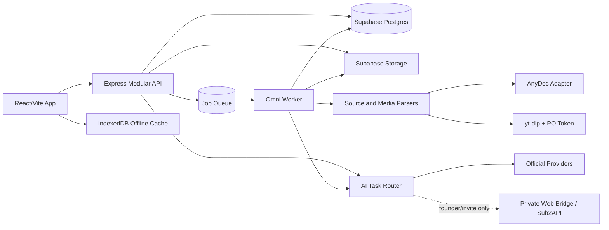

# Omni IELTS Product Rebuild Design

**Status:** Approved design baseline  
**Date:** 2026-08-29  
**Audience:** Product, design, engineering, agentic implementation workers  
**Product owner:** Solo founder  
**Repository:** `NguyenDukKyeon/Omni_IELTS`

## 1. Outcome

Omni IELTS will be rebuilt as an **IELTS-first comprehensive preparation platform** for Vietnamese self-learners preparing for IELTS Academic. Public Beta will validate the product primarily with learners around Band 4.5–6.5, while the long-term curriculum and learner model support a progression from Band 3.0 to 9.0.

The rebuild is not a UI reskin and is not a greenfield rewrite. It is a module-by-module migration that preserves reliable capabilities, replaces duplicated or unverifiable behaviour, and connects every learning activity to a shared evidence, mistake, mastery, and reassessment loop.

The product succeeds when learners improve a diagnosed subskill on an independent reassessment, not when they merely spend time, earn XP, or generate AI output.

## 2. Locked product decisions

| Decision | Locked direction |
|---|---|
| Product category | IELTS-first comprehensive preparation platform |
| Market | Vietnam-first |
| Interface | Contextual Vietnamese-English bilingual UX |
| Test type | IELTS Academic first; General Training later |
| Primary customer | Individual self-learner |
| Primary Beta band | 4.5–6.5 |
| Primary persona | Plateaued Intermediate, typically Band 5.0–5.5 |
| Long-term range | Band 3.0–9.0 through separate adaptive tracks |
| Navigation | Module-centric, not a mandatory daily-path product |
| Product structure | Seven learning modules plus global utilities |
| Private Web Bridge | Founder dogfooding and invite-only experiments only |
| Sub2API | Operator-only experiment/gateway; not a paid-tier dependency |
| Paid AI access | Deferred until dogfooding, provider terms, cost, and reliability are validated |
| Architecture | Modular monolith plus async worker and focused sidecars |
| Open source | Adopt infrastructure behind adapters; build IELTS learning logic in Omni |
| Release truthfulness | No fabricated band, transcript, pronunciation, pause, citation, or real-exam label |

## 3. Product thesis

### 3.1 Vision

Help Vietnamese IELTS self-learners turn authentic sources and their own recurring errors into structured, adaptive learning loops across all four IELTS skills.

### 3.2 Core problem

IELTS self-learners commonly use disconnected tools for vocabulary, grammar, videos, practice tests, AI feedback, and mock exams. Feedback is consumed once and forgotten; errors recur; generated content loses its source; learners cannot tell whether they are improving or simply completing more activities.

### 3.3 Value proposition

```text
Authentic source + learner error + assessment evidence
                         ↓
Targeted learning and practice
                         ↓
Actionable feedback
                         ↓
Mistake and spaced review
                         ↓
Transfer to a new task
                         ↓
Independent reassessment
```

### 3.4 Defensible differentiator

Omni will not compete by exposing the largest number of AI buttons. Its differentiator is a cross-module learning loop with provenance, evidence, mastery, relapse, transfer, and assessment.

Example:

```text
BBC video
→ Dictation error: “economic growth”
→ listening/collocation mistake evidence
→ scheduled retrieval practice
→ use in a new Writing task
→ transfer succeeds or the error relapses
→ learner profile and recommendation update
```

### 3.5 Non-goals

Public Beta will not:

- teach the full General English A1–C2 curriculum;
- support teachers, classes, assignments, or a tutor marketplace;
- issue official IELTS scores or guarantee a band increase;
- guarantee Band 8 or 9 through AI-only feedback;
- redistribute copyrighted full sources without permission;
- sell access to a shared private Web Bridge account;
- depend on a browser session or private bridge for public core journeys;
- grade pronunciation from transcript-only input;
- generate all possible artifacts automatically when a source is imported;
- build a social feed, global leaderboard, or content marketplace;
- award mastery or XP for merely revealing an answer.

## 4. Learner segmentation

### 4.1 Primary Beta persona: Plateaued Intermediate

Typical profile:

- IELTS Academic learner in Vietnam;
- current overall level around Band 5.0–5.5;
- understands the basic exam format;
- repeatedly makes the same language or strategy errors;
- struggles to turn Writing/Speaking feedback into improvement;
- is susceptible to Listening distractors and Reading paraphrases;
- wants evidence that study time is producing transfer;
- uses mobile for short study and desktop for exam-style work.

The default Beta UX, curriculum depth, feedback density, and research sample will be optimised for this persona.

### 4.2 Supported adjacent personas

| Track | Band range | Product response |
|---|---:|---|
| Foundation Repairer | 4.5–5.0 | bilingual scaffolding, micro-lessons, controlled practice, limited feedback priorities |
| Plateaued Intermediate | 5.0–5.5 | mistake-driven targeted practice and transfer checks |
| Band Optimizer | 6.0–6.5 | timed tasks, criterion feedback, precision, Mini/Full Mock |
| Foundation expansion | 3.0–4.5 | later general-English foundation curriculum and stronger scaffolding |
| Advanced expansion | 6.5–8.0 | nuance, register, complex reasoning, human-calibrated benchmarks |
| Expert refinement | 8.0–9.0 | rare-error analysis and multiple independent/human-calibrated assessments |

No single curriculum is stretched across Band 3.0–9.0 by changing a `targetBand` field. Tracks use different prerequisites, task types, feedback density, and assessment expectations.

### 4.3 Learner context

```ts
interface LearnerContext {
  testType: 'academic';
  interfaceLanguage: 'vi-en';
  currentBands: {
    listening: number | null;
    reading: number | null;
    writing: number | null;
    speaking: number | null;
  };
  examDate?: string;
  weeklyMinutes: number;
  preferredDevice: 'mobile' | 'desktop' | 'mixed';
  presentationPreferences: {
    bilingualSupport: boolean;
    audioFirst: boolean;
    guidedVsIndependent: 'guided' | 'balanced' | 'independent';
  };
  accessibilityNeeds: string[];
  aiAccessMode: 'deterministic' | 'managed' | 'byok' | 'founder_bridge';
}
```

Presentation preferences affect explanation and interaction, not unsupported “learning style” claims.

### 4.4 Primary Jobs to be Done

1. **Diagnose the plateau:** When my score does not improve, identify the subskill and recurring error holding me back so I stop practising randomly.
2. **Convert feedback into action:** When I receive Writing or Speaking feedback, turn it into a short corrective exercise and later review so the issue does not disappear with the report.
3. **Learn from authentic material:** When I find a useful article, document, chart, audio file, or video, turn it into contextual IELTS learning artifacts without losing the source.
4. **Practise under exam conditions:** When the exam approaches, provide computer-delivered practice and mock conditions so learning transfers to test performance.
5. **Prove improvement:** After several weeks, show which errors declined and which unseen-task results improved instead of showing only XP and completion.
6. **Trust feedback:** Explain which outputs are deterministic, estimated by AI, human-calibrated, or unavailable.
7. **Continue through provider failure:** Preserve deterministic and saved learning journeys when an AI or search provider is unavailable.

## 5. Learning and assessment framework

### 5.1 Shared learning loop

Every core activity participates in the following loop:

```text
Diagnose
→ Learn
→ Controlled Practice
→ Independent Production
→ Feedback
→ Remediation
→ Spaced Review
→ Transfer Task
→ Independent Assessment
→ Learner Profile Update
```

An activity may enter the loop at a different stage, but it must not end without a defined evidence or continuation state.

### 5.2 Competency graph

The learner model is multidimensional rather than a single overall band.

```text
IELTS Academic
├── Foundation
│   ├── Core Vocabulary
│   ├── Grammar Control
│   ├── Sentence Construction
│   ├── Phonological Awareness
│   └── Basic Comprehension
├── Listening
│   ├── Detail Recognition
│   ├── Number and Spelling Accuracy
│   ├── Connected Speech
│   ├── Distractor Resistance
│   ├── Speaker Attitude
│   └── Question Types
├── Reading
│   ├── Skimming
│   ├── Scanning
│   ├── Paraphrase Recognition
│   ├── Inference
│   ├── Reference Tracking
│   └── Question Types
├── Writing
│   ├── Task Achievement/Response
│   ├── Idea Development
│   ├── Paragraph Unity
│   ├── Cohesion
│   ├── Lexical Precision
│   ├── Grammar Accuracy
│   ├── Task 1 Overview
│   └── Task 1 Data Selection
└── Speaking
    ├── Fluency
    ├── Coherence
    ├── Interaction
    ├── Lexical Resource
    ├── Grammar
    ├── Pronunciation
    ├── Prosody
    └── Part-specific Skills
```

Curriculum nodes declare prerequisites. Advanced activities are not recommended while blocking prerequisites remain weak.

### 5.3 Mastery lifecycle

```text
unseen → introduced → practising → stable → mastered → relapsed
```

- `introduced` means content was taught, not remembered.
- `stable` requires unassisted controlled performance.
- `mastered` requires repeated evidence over time and transfer to a new task.
- `relapsed` reopens a previously stable/mastered error when it appears in independent Practice or Mock.

History is archived, not deleted, when mastery is reached.

### 5.4 Evidence hierarchy

Evidence strength increases down this list:

1. Exposure: viewed explanation, answer, or audio.
2. Assisted performance: used hints, transcript, word bank, or scaffolding.
3. Unassisted retrieval: answered without help.
4. Production: independently wrote or spoke.
5. Transfer: applied the skill in a new topic/task.
6. Independent assessment: succeeded in an unseen Mini/Full Mock.

Viewing an answer, copying a model response, using reveal, receiving an AI-written answer, or submitting empty audio cannot create mastery evidence.

### 5.5 Competency state

```ts
interface CompetencyState {
  competencyId: string;
  state: 'unseen' | 'introduced' | 'practising' | 'stable' | 'mastered' | 'relapsed';
  estimatedMastery: number;
  uncertainty: number;
  evidenceCount: number;
  independentEvidenceCount: number;
  transferEvidenceCount: number;
  lastEvidenceAt?: string;
  nextReviewAt?: string;
  recurringMistakeIds: string[];
  prerequisiteGaps: string[];
}
```

`estimatedMastery` is not converted directly into an IELTS band.

### 5.6 Feedback policy

Feedback answers five questions: what happened, where, why, how to correct it, and what to practise next.

| Segment | Default feedback density |
|---|---|
| Foundation Repairer | 1–3 high-impact issues, bilingual explanation, short example |
| Plateaued Intermediate | 3–5 taxonomy-linked issues, root cause, targeted drill, rewrite/retry |
| Band Optimizer | criterion breakdown, precision/nuance, transfer task |

AI may propose taxonomy and feedback, but all structured outputs pass schema and quality validation.

### 5.7 Assessment layers

| Layer | Purpose | Band policy |
|---|---|---|
| Placement diagnostic | starting point and prerequisite gaps | approximate placement, not an official band |
| Formative assessment | feedback during learning | no official-band claim |
| Skill check | unseen transfer after a learning unit | subskill evidence |
| Mini Mock | timed readiness check | score/estimate with validation |
| Full Mock | independent four-skill assessment | deterministic raw scores plus labelled estimates |
| Human calibration | internal Writing/Speaking validation | validates AI, not a public teacher feature in Beta |

Listening/Reading raw score is deterministic when the package is valid. Writing/Speaking reports are labelled AI estimates with confidence and limitations. Missing evidence yields `unavailable`, never a default band.

### 5.8 Recommendation policy

Public Beta begins with explainable rules rather than opaque machine learning. A recommendation includes its evidence-based reason and never prevents manual module navigation.

Example:

```text
Recommended: Article Mistake Drill
Reason: Article errors appeared in two recent Writing attempts and are due for review.
```

## 6. Product information architecture

### 6.1 Module-centric navigation

```text
Dashboard

1. Sources & Library
2. Vocabulary
3. Grammar & Strategy
4. Media Lab
5. IELTS Practice
6. IELTS Mock
7. Review & Progress

Global: AI Tutor, Voice Library, Profile, Notifications
```

Daily Coach remains a Dashboard recommendation surface. It does not replace module choice or force a single learning path.

### 6.2 Shared module template

Each module presents:

```text
Module Header
├── module objective
├── progress
└── one primary CTA

Quick Start
├── resume unfinished work
└── evidence-based recommendation

Workspace
├── primary learning/practice
├── library
└── advanced tools

Progress
├── recent results
├── recurring weaknesses
└── next action
```

## 7. Module boundaries

### 7.1 Sources & Library

Owns source import, workspaces, raw and normalised versions, provenance, citations, labels, source selection, processing jobs, and Live Hub source records. It emits versioned source references for downstream artifacts. It does not own FSRS, Practice grading, Mock state, Media recording, or mistake scheduling.

### 7.2 Vocabulary

Owns canonical vocabulary cards, decks, contextual meaning, word families, collocations, vocabulary exercises, FSRS scheduling, vocabulary mastery, and import/export. It consumes source provenance, shared Voice, and Learning Evidence contracts.

### 7.3 Grammar & Strategy

Owns grammar/IELTS strategy curriculum, prerequisites, bilingual instruction, controlled exercises, diagnosis, model-answer annotation, and transfer tasks. It emits mistake evidence but does not own mistake scheduling or skill graders.

### 7.4 Media Lab

Owns Media lessons, transcript versions/segments, original player, Shadowing, Dictation, recording attempts, word-level diff, acoustic input, and Media progress. It emits listening, spelling, fluency, and pronunciation evidence. Raw source ownership remains in Sources.

### 7.5 IELTS Practice

Owns Reading, Listening, Writing, and Speaking activities; question engines; attempt and hint/reveal state; skill-specific grading; feedback; Live Hub-to-Practice conversion; and Speaking Examiner Room. It emits skill and mistake evidence.

### 7.6 IELTS Mock

Owns Mock builds/packages, validators, exam state machine, CDI interactions, timers, autosave/resume, submission, raw scores, reports, history, and Live Hub-to-Mock conversion. Independent Mock evidence carries more weight than assisted Practice.

### 7.7 Review & Progress

Owns unified mistakes, due reviews, mastery/relapse, cross-module evidence, recommendation rules, progress snapshots, retention/transfer reporting, and feedback inbox. It consumes events emitted by every learning module.

### 7.8 Global services

- **AI Router:** capability-aware provider/model selection, validation, fallback, cost, latency.
- **AI Tutor:** contextual conversation, explicit Research, citations, saved notes.
- **Voice Library:** browser/Gemini voices, preference, cache, fallback.
- **Learning Evidence Engine:** shared LearningEvent, SkillEvidence, MistakeEvidence, MasteryUpdate.
- **Identity & Privacy:** auth, ownership, consent, BYOK, RLS, export/delete.
- **Search Grounding:** claim citations, fresh/stale/unavailable, snapshots, provider trace.

## 8. Multi-source Learning Workspace

### 8.1 Core behaviour

One workspace contains multiple heterogeneous sources. Users batch import, inspect per-source jobs, label/search, select or exclude sources from context, chat with citations, and generate IELTS artifacts from one or more selected sources.

Beta source types:

- pasted text and Markdown;
- PDF and DOCX;
- web URLs;
- public YouTube URLs;
- audio;
- VTT/SRT;
- images/charts for Academic Writing Task 1.

Drive sync, Slides/Sheets, PowerPoint, CSV data, EPUB, public sharing, and automated research are later capabilities unless a focused spike proves they are cheap and necessary.

### 8.2 Desktop and mobile

Desktop uses a three-area workspace:

```text
Sources panel | Preview/Chat/Notes | IELTS Artifact Studio
```

Mobile uses three tabs:

```text
Sources | Learning Workspace | Create
```

### 8.3 Provenance and conflicts

Every generated claim keeps source version and block/page/timestamp span. Conflicting sources are surfaced rather than silently reconciled. Removing a source prevents future AI use while preserving minimum lineage metadata for already-created artifacts.

### 8.4 Source pipeline

```text
Source
→ Extract
→ Normalise
→ Validate
→ Classify difficulty
→ Generate artifact on request
→ Validate answerability/quality
→ ready | needs_review | rejected
```

Importing a source does not automatically spend AI quota on every possible artifact.

## 9. Open-source strategy

### 9.1 Principle

Omni builds product differentiation and adopts generic infrastructure through replaceable adapters.

```text
Open source reads/processes generic data.
Omni decides how that data teaches and assesses IELTS.
```

### 9.2 Candidate stack

| Capability | Candidate | Direction |
|---|---|---|
| Office/text-PDF parsing | `firecrawl/anydoc` | focused spike, exact version pin, fallback |
| Web extraction | Mozilla Readability + DOMPurify | adopt |
| YouTube/captions | yt-dlp + PO-token provider | retain |
| Audio waveform | Wavesurfer.js | retain/adopt |
| Text diff | jsdiff/diff-match-patch | adopt |
| Vocabulary scheduling | ts-fsrs | retain |
| Exam state | XState | retain/adopt |
| Offline storage | Dexie.js | candidate |
| Semantic search | Supabase pgvector | later Knowledge/RAG phase |
| Browser VAD | `@ricky0123/vad-web` | retain |
| OCR | local Docling/Tesseract/PaddleOCR adapter | later research |

### 9.3 AnyDoc boundary

AnyDoc is a candidate for Office and text-based PDF conversion behind `DocumentParser`. Omni owns the canonical parsed document model, page/block provenance, quality validation, storage, and learning conversion. Hosted OCR is off by default; it requires explicit consent because the document leaves the device/server boundary.

The AnyDoc spike benchmarks Vietnamese Unicode, tables, charts, page mapping, malformed/encrypted/scanned files, memory, speed, Linux Docker, Windows, browser WASM, license, SBOM, and supply-chain risk. Self-reported upstream benchmarks are not sufficient for adoption.

## 10. Product requirements

Public Beta requires:

1. Onboarding, placement, and a multidimensional learner profile.
2. Clear seven-module navigation with one primary CTA, resume, and full UI states.
3. Shared LearningEvent, Attempt, Evaluation, SkillEvidence, MistakeEvidence, and ProgressUpdate contracts.
4. Explainable, prerequisite-aware recommendations.
5. Multi-source workspaces with independent jobs, selection, citations, provenance, deletion, and export.
6. Contextual Vocabulary capture, deduplication, FSRS, retrieval, mastery, relapse, and export.
7. Curriculum-based Grammar/Strategy instruction, controlled practice, production, and mistake emission.
8. Original-audio Media learning with full transcript, Shadowing, Dictation, resume, diff, and honest acoustic availability.
9. Four-skill Practice with save/resume, feedback-to-action, assisted/unassisted state, and provenance.
10. Validated Mock packages, strict exam state, CDI interactions, autosave, report/history, and independent evidence.
11. Unified due review, mistake lifecycle, competency trends, evidence drawer, and recommendations.
12. AI task routing, structured validation, labelled confidence/limitations, cost budgets, and truthful unavailability.
13. Deterministic and saved learning paths that remain usable when AI/search providers fail.

## 11. Non-functional requirements

### 11.1 Performance

- usable shell p75 at or below 2.5 seconds on a representative mobile connection;
- cached module navigation at or below 500 ms;
- local autosave acknowledgement at or below 300 ms;
- visible interaction feedback at or below 100 ms;
- long-running work represented as resumable jobs with progress;
- advanced modules and provider SDKs lazy-loaded.

### 11.2 Reliability

- attempts survive reload;
- important artifacts survive server restart;
- jobs are idempotent, retryable, cancellable, and time-bounded;
- provider failure cannot create a fake artifact;
- stale snapshots show timestamps;
- every external call has a scrubbed request ID and capability-aware circuit breaker.

### 11.3 Accessibility and compatibility

- WCAG 2.2 AA target;
- keyboard-only operation and visible focus;
- screen-reader labels and semantic states;
- touch-safe controls, reduced motion, adequate contrast, and no colour-only meaning;
- Public Beta supports current Chrome/Edge, desktop width at least 1280 px, mobile 360–430 px, and responsive tablets;
- Safari/Firefox expansion follows core validation.

### 11.4 Security and privacy

- owner RLS and validated auth;
- encrypted credentials and no secret reflection;
- raw microphone audio is not stored by default;
- explicit consent for transcript/telemetry storage and any hosted OCR;
- source export/delete and hard-delete privacy workflow;
- file/MIME/decompression limits, HTML sanitisation, rate limits, and secret-safe logs;
- private Web Bridge and Sub2API are isolated from public entitlements.

### 11.5 Cost

Every AI/search/voice capability declares maximum calls, token/input/output limits, cache policy, fallback policy, and quota class before public release.

## 12. Success metrics

### 12.1 North-star metric

Percentage of eligible learners who improve at least one diagnosed target subskill on an independent reassessment after four weeks.

Eligibility requires a baseline, sufficient learning-loop participation, and an unseen reassessment.

### 12.2 Metric groups

- **Learning:** error recurrence, unassisted accuracy, transfer, 7/30-day retention, raw Reading/Listening change, human-calibrated Writing/Speaking criterion change, hint dependency, mastery-to-relapse.
- **Engagement:** diagnostic completion, first-loop completion, feedback-to-drill conversion, resume success, D7/D30 retention, weekly completed loops.
- **Trust:** feedback acceptance/rejection, disagreement reports, citation usage, provider recovery, zero fabricated-data incidents, zero secret/privacy incidents.
- **Operations:** provider/schema success, p50/p95 latency, cost per completed loop, job/retry failure, support incidents, source success by format.

### 12.3 Pilot

Alpha uses 10–20 Vietnamese IELTS Academic self-learners around Band 4.5–6.5 to establish baseline usability and failure modes. The initial four-week Public Beta pilot uses roughly 30–60 learners when operationally manageable.

Provisional hypotheses:

- at least 60% diagnostic completion;
- at least 50% first-loop completion;
- at least 40% of learners receiving feedback start the follow-up drill;
- at least 25% D7 retention;
- at least 60% of eligible baseline/retest learners improve a target subskill;
- median recurrence of targeted mistakes decreases at least 20%;
- 100% “improved” claims expose supporting evidence;
- zero fabricated band/transcript/real-exam incidents;
- zero secret/privacy incidents.

These targets are product hypotheses, not marketing claims, and are recalibrated after Alpha.

## 13. Target architecture

### 13.1 Deployment



The target is a modular monolith, not microservices: one web/API deployment, one worker, Supabase Postgres/Auth/Storage/RLS, optional Redis, and focused sidecars.

### 13.2 Bounded contexts

- Identity & Privacy
- Source Ingestion
- Content & Provenance
- Curriculum
- Learning Activity
- Assessment
- Mastery & Scheduling
- Mistake Lifecycle
- Mock Exam
- AI Orchestration
- Voice & Media
- Progress & Analytics

Each context exposes explicit contracts and owns its tables. Modules do not import one another’s internals.

### 13.3 Core lineage

```text
SourceVersion
→ LearningArtifact
→ Attempt
→ Evaluation
→ MistakeEvidence
→ ReviewAttempt
→ MasteryUpdate
```

### 13.4 Immutable versioning

Source versions, ready Mock packages, and assessment artifacts are immutable. Attempts point to exact versions. Resyncing/reimporting creates a new source version rather than mutating previous evidence.

### 13.5 Async jobs

Document parsing, OCR, YouTube import, audio transcription, large artifact/Mock/TTS generation, and large assessments execute through a `JobQueue` abstraction. Public job states are `queued`, `preparing`, `processing`, `validating`, `retry_wait`, `ready`, `failed`, and `cancelled`.

Initial implementation uses a Postgres-backed queue/worker with locking, not Kafka/RabbitMQ/Trigger.dev.

### 13.6 API conventions

New endpoints use `/api/v1` and return:

```ts
interface ApiSuccess<T> {
  data: T;
  requestId: string;
}

interface ApiFailure {
  code: string;
  category: string;
  status: number;
  message: string;
  retryable: boolean;
  retryAfter?: number;
  recoveryAction?: string;
  requestId: string;
}
```

Legacy endpoints remain temporary facades until all callers and evidence migrate.

## 14. Private AI and Sub2API policy

Sub2API `v0.1.179` technically supports user/API-key distribution, account/group routing, sticky sessions, per-user and per-account concurrency, RPM, and per-platform daily/weekly/monthly quotas. This does not make shared subscription access an approved commercial product.

Upstream itself warns of provider Terms-of-Service, ban, interruption, loss, and commercial-operation risks. Therefore:

- Private Web Bridge and Sub2API remain founder-only or invite-only experiments.
- They have separate health checks, canaries, feature flags, and kill switches.
- Public users and paid entitlements cannot depend on them.
- Omni never exposes Sub2API admin or user API keys directly to the browser.
- A paid AI plan requires official API/BYOK or a provider/reseller with explicit commercial terms.
- The paid/quota model is deferred until dogfooding establishes quality, reliability, cost, and compliance.

## 15. Capability Registry

Every capability is registered with stable ID, owner, learner job, target segments/bands, priority, release phase, learning mechanism, prerequisites, consumed/produced contracts, state machine, API/data owner, provider dependency, privacy class, metric, evidence, acceptance tests, and lifecycle status.

```ts
interface ProductCapability {
  id: string;
  name: string;
  owner: 'sources' | 'vocabulary' | 'grammar_strategy' | 'media' |
    'practice' | 'mock' | 'review_progress' | 'global';
  learnerJob: string;
  targetSegments: string[];
  targetBandRange: [number, number];
  priority: 'core' | 'advanced' | 'later' | 'reject';
  releasePhase: 'beta' | 'post_beta' | 'research';
  learningMechanism: 'instruction' | 'retrieval' | 'production' |
    'feedback' | 'spacing' | 'transfer' | 'assessment' | 'utility';
  prerequisites: string[];
  consumes: string[];
  produces: string[];
  stateMachine?: string;
  apiOwner?: string;
  dataOwner: string;
  providerDependency: 'none' | 'browser' | 'official_ai' | 'search' | 'private_bridge';
  privacyClass: 'public_metadata' | 'private_learning' | 'sensitive_audio' | 'credential';
  successMetric: string;
  evidenceRequired: string[];
  uxFlowContractId: string;
  acceptanceTestIds: string[];
  status: 'discovered' | 'approved' | 'specified' | 'implemented' |
    'deterministic_verified' | 'live_verified' | 'released';
}
```

Stable ID families include `SRC`, `VOC`, `GRM`, `STR`, `MED`, `PRC`, `MCK`, and `REV`.

## 16. Delivery decomposition

### 16.1 Documentation hierarchy

```text
Product Strategy
→ Learning & Assessment Framework
→ Capability Registry
→ PRD
→ Domain UX/System Specs
→ Architecture and ADRs
→ Epic Dependency Map
→ Stories and Tasks
→ Acceptance Criteria and Test Matrix
→ Pilot Plan
```

Requirements use traceable IDs:

```text
PRD-001 → CAP-SRC-001 → SPEC-SRC-001 → ADR-001
→ EPIC-SRC-01 → STORY-SRC-01 → TASK-SRC-001
→ AC-SRC-001 → TEST-SRC-001
```

### 16.2 Epic dependency order

1. Product specs and baseline
2. Platform contracts
3. Design System and App Shell
4. Learning Evidence Engine
5. Sources Workspace and AnyDoc spike
6. Media Learning Room
7. IELTS Practice sub-epics (Reading, Listening, Writing, Speaking, Live Hub)
8. IELTS Mock
9. Vocabulary
10. Grammar & Strategy
11. Review & Progress
12. Tutor, Profile, Voice, and entitlements
13. Pilot and Public Beta

Each epic produces a reviewable learner outcome and is split when it contains independent state machines.

### 16.3 Definition of Ready

An epic is dispatchable only when it has product requirement/capability IDs, target segment, user journey, module owner, state/API/data contracts, privacy/cost class, feature flag, non-goals, acceptance criteria, fixtures, branch/base SHA, and migration context.

### 16.4 Definition of Done

An epic is done only when acceptance criteria, unit/API tests, desktop/mobile E2E, accessibility, UX contracts, typecheck/build, privacy/security review, cost/latency evidence, feature flag/rollback, docs, coordinator review, and any required live canary pass with no open P0/P1.

### 16.5 Agentic worker control

Large epics may be implemented by Grok or another worker only from a scoped handoff packet containing objective, base SHA, required documents, exact interfaces, scope/non-goals, acceptance criteria, tests, security/privacy limits, commit workflow, and final evidence format.

Workers implement and push feature branches; they never merge. The coordinator verifies, reproduces, reviews, runs release gates, and merges/deletes branches only when gates pass.

## 17. Release and migration strategy

The rebuild uses a strangler migration rather than a big-bang rewrite:

```text
Existing component/endpoint
→ facade
→ new module/service
→ caller migration
→ deprecation evidence
→ legacy removal
```

Core release conditions include no P0/P1, complete core UX contracts, evidence emission, RLS and deletion/export paths, deterministic gate, required live canary evidence no older than 24 hours, accessibility, cost limits, and rollback flags. Web Bridge cannot become a public release dependency.

## 18. Product risks and controls

| Risk | Control |
|---|---|
| Feature-rich but ineffective | shared learning/evidence loop and independent reassessment |
| One curriculum stretched across Band 3–9 | segment-specific tracks and prerequisites |
| AI grading drift | golden/human-calibrated evals, confidence labels, unavailable state |
| Copyright leakage | source ownership, provenance, metadata-only public surfaces |
| Provider failure/cost | deterministic core, quotas, capability fallback, caching, kill switches |
| Private bridge commercial risk | founder/invite-only isolation and no paid dependency |
| Big-bang rewrite failure | vertical strangler migration and per-epic release gates |
| Solo-founder operations overload | modular monolith, one worker, limited sidecars, deferred marketplaces |
| Open-source supply-chain churn | adapter boundary, exact pins, SBOM, fixtures, fallback/removal plan |
| Engagement mistaken for learning | north-star independent subskill improvement and counter-metrics |

## 19. Evidence sources informing the design

- [IELTS scoring in detail](https://ielts.org/take-a-test/your-results/ielts-scoring-in-detail)
- [IELTS and the CEFR](https://ielts.org/organisations/ielts-for-organisations/compare-ielts/ielts-and-the-cefr)
- [Distributed practice meta-analysis](https://pubmed.ncbi.nlm.nih.gov/16719566/)
- [The critical importance of retrieval for learning](https://pubmed.ncbi.nlm.nih.gov/18276894/)
- [Gemini Notebook source model](https://support.google.com/gemininotebook/answer/16215270?hl=en)
- [Gemini Notebook citations and selected-source chat](https://support.google.com/gemininotebook/answer/16179559?hl=en)
- [Gemini Notebook flashcards and quizzes](https://support.google.com/gemininotebook/answer/16958963?hl=en)
- [ELSA Speak product capabilities](https://elsaspeak.com/en/)
- [Speechling listen-record-feedback workflow](https://speechling.com/)
- [YouGlish contextual pronunciation](https://youglish.com/)
- [Anki spaced review](https://apps.ankiweb.net/)
- [ShadowingEnglish sentence-by-sentence workflow](https://shadowingenglish.com/)
- [British Council IELTS Ready](https://takeielts.britishcouncil.org/prepare/ielts-ready)
- [AnyDoc](https://github.com/firecrawl/anydoc)
- [Sub2API v0.1.179](https://github.com/Wei-Shaw/sub2api/tree/v0.1.179)

## 20. Next documentation gate

This design document is the approved product and architecture baseline. The next work item is `PRODUCT_STRATEGY.md`, followed by `LEARNING_AND_ASSESSMENT_FRAMEWORK.md`, `CAPABILITY_REGISTRY.md`, and `PRD.md` in that order.

No rebuild implementation begins until this design document is reviewed in-repository and the derived product documents preserve its locked decisions and traceability.
