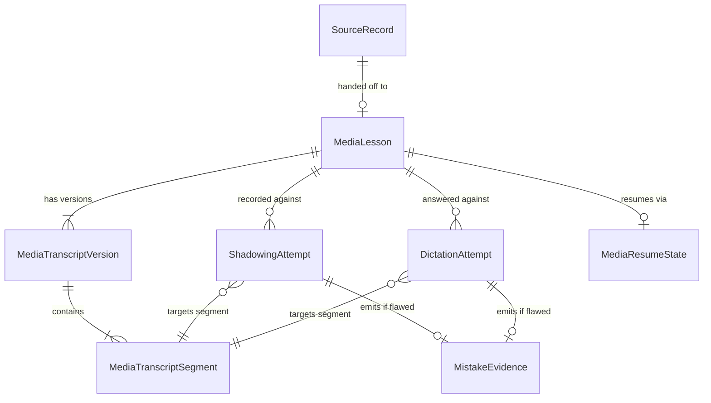
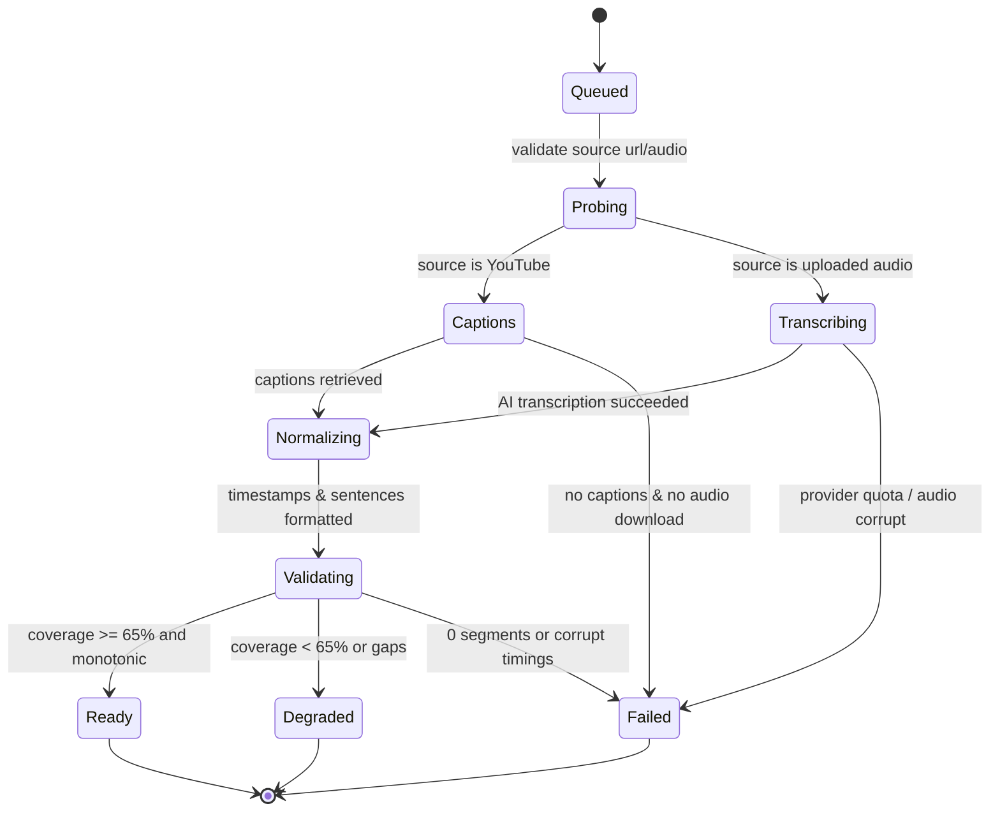
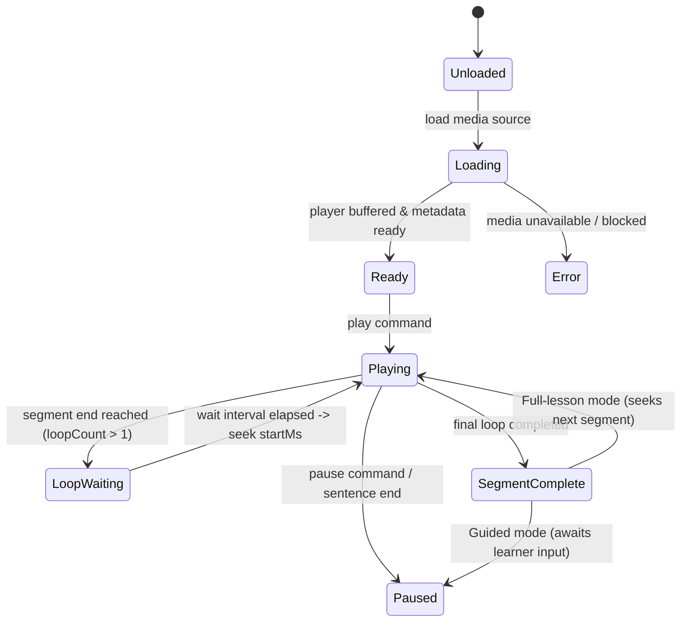
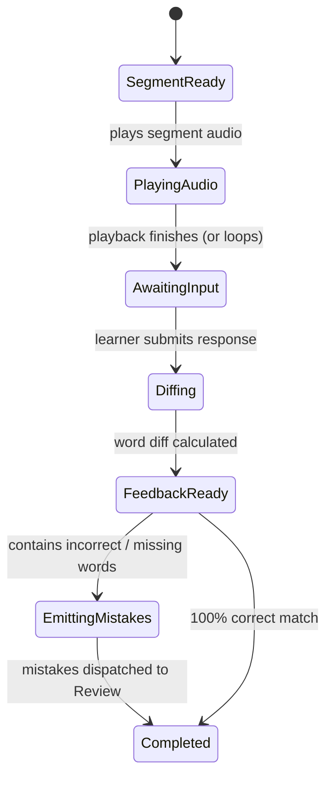

# OMNI Media Learning Room Domain Specification and Architecture (P04)

**Status:** Draft specification (implementation blocked pending P03 merge and Product Owner approval)
**Date:** 2026-09-04
**Owner:** Media Module (`owner: media`)
**Architecture Context:** Voice & Media / Learning Activity / Assessment
**Document Type:** Domain Specification & UX Architecture Contract
**Program Map Reference:** `docs/superpowers/plans/2026-08-30-omni-rebuild-program-map.md`
**Prerequisites:** P02 Approved Brand/UX Shell; P03 Sources & Library merged into `origin/main` (PR #16)

---

## 1. Executive Summary & Problem Framing

### 1.1 Purpose

This document defines the complete product and engineering specification for the **OMNI Media Learning Room (P04)**. It redesigns the legacy prototype media views (`MediaLabView`, `ShadowingStudio`, `DictationStudio`) into a unified, **Guided-first Media Learning Room** that enables IELTS learners to develop listening comprehension, connected speech prosody, and spelling accuracy from authentic audio and video sources.

P04 consumes media references handed off from Sources (P03) or directly imported by the learner, manages the complete immutable transcript lifecycle, controls original media playback with sub-second segment synchronization, drives Guided and Independent Shadowing and Dictation practice, enforces strict learner audio privacy, and emits canonical `MistakeEvidence` to the Review module without fabricating transcripts, scores, or mastery.

### 1.2 Core Architectural Principles

1. **Guided-First Pedagogical Loop**: The default learning mode is scaffolded segment-by-segment progression: listen to original authentic audio → shadow or dictate → inspect honest formative feedback and word-level diffs → retry or progress.
2. **Media Consumes Sources; Sources Keep Provenance**: When media originates in the Sources Library (P03), Media receives a typed handoff reference pointing to `source_records.id` and `source_versions.id`. Media owns caption retrieval, transcription, segmentation, and playback, while Sources retains citation and provenance boundaries.
3. **Immutable Transcript Versions & Fine-Grained Alignment**: Transcripts are versioned (`raw_caption`, `ai_transcription`, `user_edited`, `normalised`). Transcript segments have immutable boundaries and stable identifiers (`seg_<hash>`), strictly separated from transient learner attempt states.
4. **Honest Availability Over Speculative Scoring**:
   - Pronunciation and prosody scoring require real microphone audio and valid Voice Activity Detection (VAD) / speech timestamps. If the microphone is absent or permission is denied, acoustic scoring is explicitly `unavailable`; the system never scores pronunciation from speech-to-text text or transcript alone (`GUARD-001`).
   - Dictation requires original audio playback and text/touch response. Missing microphone disables Shadowing evaluation but **must never disable Dictation** (`PRD-008`).
   - Missing transcripts or provider failures yield an honest `unavailable` or `degraded` state; the system never fabricates transcripts or estimates bands.
5. **Zero Direct Mastery or XP Generation**: Media Room emits zero direct `MasteryUpdate`, XP rewards, or automatic flashcards. Dictation emits listening/spelling `MistakeEvidence` from real learner errors. Shadowing emits pronunciation/prosody `MistakeEvidence` only when acoustic measurement is valid. All progress, SRS scheduling, and mastery updates are owned downstream by Review & Progress (`P05`).
6. **Privacy-by-Default Audio Architecture**: Raw learner microphone audio is ephemeral by default and never stored in cloud databases. Local persistence uses client-side IndexedDB (`omni_ielts_media_artifacts_v1`) only upon explicit learner consent.
7. **Deploy-Level Feature Flag & Safe Fallback**: Media Room v2 operates behind `OMNI_MEDIA_ROOM_V2`. When disabled, the application renders the existing fallback facade without schema breaks.

### 1.3 Program Map Ownership & Boundary Contract

| Concern / Input | Media (P04) Owns | Media (P04) Forbidden | Owner / Delegate |
|---|---|---|---|
| YouTube URL | Caption extraction, yt-dlp job coordination, streaming player iframe integration | Direct downloading of copyrighted video files for long-term server hosting; bypassing PO-token provider boundary | P04 (ingestion) / YouTube Provider |
| Audio Files (MP3, WAV, M4A) | Audio decoding, waveform generation via Wavesurfer, AI transcription via `CAP-MED-TRANSCRIPT`, segment alignment | Inventing transcripts when audio is corrupt or transcription fails | P04 / Official AI Provider |
| Source Provenance | Consuming handoff from P03, linking `sourceRecordId` and `sourceVersionId` | Owning `SourceRecord`, `SourceVersion`, collections, or library search | Sources (`P03`) |
| Academic Task 1 Charts | Routing chart requests to Academic Mock | Parsing or rendering Task 1 charts | Mock (`P07`) |
| Practice Persisted Items | Emitting completed listening/spelling/prosody evidence | Creating four-skill practice units, reading passages, or questions | Practice (`P06`) |
| Mistake Lifecycle & Mastery | Emitting canonical `MistakeEvidence` with `provenance.module = 'media'` | Incrementing learner XP, mutating SRS stages, updating target bands | Review & Progress (`P05`) |
| Private Web Bridge | None | Depending on public or paid `CAP-GLB-PRIVATE-WEB-BRIDGE` | Founder / Invite-only |

---

## 2. Traceability & Capability Mapping

### 2.1 Product Baseline Alignment

| Baseline ID | Capability Name | Mechanism | Primary Guard / Metric | Spec Section |
|---|---|---|---|---|
| `PRD-008` | Media Learning Loop | Guided Shadowing and Dictation from original audio/video | `GUARD-001`, `METRIC-003` | Sections 4, 5 |
| `CAP-MED-IMPORT` | Media Lesson Import | yt-dlp caption fetch, audio upload, P03 handoff intake | `METRIC-006` | Section 4.1 |
| `CAP-MED-TRANSCRIPT` | Complete Transcript Versions | Timed segmentation, versioning, coverage validation | `GUARD-001` | Section 3.2, 4.1 |
| `CAP-MED-PLAYER` | Original Media Player | YouTube & Wavesurfer players, sub-second loop, A-B loop | `METRIC-005` | Section 4.2 |
| `CAP-MED-SHADOWING` | Shadowing with Acoustic Input | Real mic capture, client VAD telemetry, Gemini acoustic grading | `METRIC-003`, `GUARD-001` | Section 4.3, 6.3 |
| `CAP-MED-DICTATION` | Dictation & Word-level Diff | Word-level diff via `jsdiff` adapter, sentence/gap/arrange modes | `METRIC-002` | Section 4.4, 6.2 |
| `CAP-MED-RESUME` | Media Attempt Resume | Segment position and attempt state recovery on reload | `METRIC-006` | Section 4.5 |
| `CAP-GLB-VOICE` | Voice Architecture | VAD integration via `@ricky0123/vad-web`, audio capture | `METRIC-003` | Section 4.3, 7.1 |
| `CAP-GLB-EVIDENCE` | Canonical Evidence Bridge | Formatting `MistakeEvidence` for Review module | `GUARD-001` | Section 6 |

### 2.2 Acceptance Criteria Matrix

The following table defines the normative acceptance criteria for P04. These identifiers are specific to P04 verification and do not modify the global product documentation registry:

| ID | Category | Scenario / Trigger | Expected Truthful Behavior |
|---|---|---|---|
| `AC-MED-001` | Handoff | P03 YouTube handoff received | System creates `MediaLesson` with reference to `sourceRecordId`, initiates caption check, displays YouTube player without re-extracting text in Sources. |
| `AC-MED-002` | Handoff | P03 Audio handoff received | System creates `MediaLesson` referencing `sourceVersionId`, loads audio waveform, triggers `CAP-MED-TRANSCRIPT` if transcript not already present. |
| `AC-MED-003` | Import | Direct YouTube URL import with valid English captions | `MediaImportJob` executes `probing` → `captions` → `normalizing` → `validating` → `ready`. Transcript coverage ≥ 65% of media duration. |
| `AC-MED-004` | Import | Direct YouTube URL import with NO captions | Job halts at `captions`, transitions to `failed` with code `CAPTIONS_UNAVAILABLE`, prompts learner to upload audio or paste transcript. Never fabricates transcript. |
| `AC-MED-005` | Import | Audio file upload (MP3/WAV/M4A ≤ 14MB) | Audio decoded, waveform initialized, AI transcription parses speech into sentences with `startMs`, `endMs`, `confidence`. |
| `AC-MED-006` | Import | VTT/SRT file upload | File parsed into timed segments, validated for monotonic timestamps and minimum text length, saved as `imported` version. |
| `AC-MED-007` | Import | Provider quota exhaustion or server error | Returns typed `MEDIA_AI_QUOTA_EXHAUSTED` or `MEDIA_IMPORT_FAILED` with clean Vietnamese user message and request ID; raw stack trace and credentials scrubbed. |
| `AC-MED-008` | Transcript | Learner edits transcript text | System saves new immutable `MediaTranscriptVersion` with incremented version number, `stage: 'edited'`, and `normalizerVersion: 'user-edited-v1'`. |
| `AC-MED-009` | Transcript | Incomplete / truncated transcript | If transcript coverage < 65% of media duration, status marks `coverage_insufficient`; room displays honest warning badge and prevents full-lesson auto-completion. |
| `AC-MED-010` | Player | Playback control invocation | Player supports 0.5x, 0.75x, 1.0x, 1.25x, 1.5x speed; loops current segment N times; waits declared milliseconds (0ms, 800ms, 1500ms, 3000ms) between iterations. |
| `AC-MED-011` | Player | Sentence progression | When current sentence completes in Guided mode, player pauses or loops according to settings; auto-advances only when full-lesson mode is explicitly enabled. |
| `AC-MED-012` | Shadowing | Microphone available and permission granted | Learner audio recorded via `MediaRecorder`; `@ricky0123/vad-web` calculates speech segments, pauses, and WPM; Gemini evaluates acoustic audio; returns scores. |
| `AC-MED-013` | Shadowing | Microphone missing or permission denied | Acoustic status displays `unavailable`; evaluation button is disabled with explanatory note; system never requests AI score and never estimates band from text. |
| `AC-MED-014` | Shadowing | Evaluation returns low accuracy / swallowed words | System formats `MistakeEvidence` with `taxonomy: 'pronunciation'`, `evidenceClass: 'assisted_practice'`, and links to Review queue without awarding direct XP. |
| `AC-MED-015` | Dictation | Dictation practice started | Original segment audio plays; learner enters text via typing, gap-fill, or word-arranging; **zero microphone permission requested or required**. |
| `AC-MED-016` | Dictation | Microphone denied in browser | Dictation input and evaluation remain 100% functional and unobstructed. |
| `AC-MED-017` | Dictation | Spelling / omission error detected | `diffWords` computes word-level diff; incorrect and missing words generate listening/spelling `MistakeEvidence` containing expected vs actual tokens. |
| `AC-MED-018` | Evidence | Perfect Dictation or Shadowing score | Generates `SkillEvidence` record for practice session; zero direct XP increment in Media Room; zero direct manipulation of mastery status. |
| `AC-MED-019` | Privacy | Shadowing recording finished | Raw audio blob kept in browser memory; if persistence consent is false, audio discarded on segment change; if true, stored in local IndexedDB (`idb-media://`). Raw audio never stored in Supabase tables. |
| `AC-MED-020` | Privacy | Learner requests lesson deletion | All local IndexedDB audio artifacts associated with the lesson are deleted; Supabase records cascade delete. |
| `AC-MED-021` | Resume | Browser reloaded during session | Room restores `activeSegmentId`, `mode`, `speed`, and previous valid attempt scores without losing user inputs. |
| `AC-MED-022` | Resume | Reload when transcript generation was pending/failed | Room restores failed or degraded state truthfully; never converts incomplete job into ready state or fabricated score. |
| `AC-MED-023` | Accessibility | Keyboard navigation | Arrow keys navigate sentences; Space toggles playback; R triggers repeat loop; Escape halts recording; all controls possess accessible ARIA labels. |
| `AC-MED-024` | Accessibility | Screen reader announcement | Playback state, loop status, recording countdown, and evaluation results announced via dedicated `aria-live="polite"` regions. |
| `AC-MED-025` | Flag | Feature flag `OMNI_MEDIA_ROOM_V2` OFF | Express serves legacy `MediaLabView`; cloud endpoints reject v2 requests with HTTP 403 `feature_disabled`. |

### 2.3 Fixture Matrix

Every test suite must execute against concrete fixtures representing real-world edge cases:

| Fixture ID | Source Type | Characteristics | Key Test Objective |
|---|---|---|---|
| `FIX-MED-01` | YouTube Video | Standard English captions (VTT), duration 180s, 30 segments | Verifies clean caption parsing, coverage calculation, and segment alignment. |
| `FIX-MED-02` | YouTube Video | Auto-generated rolling captions with heavy overlap and timing drift | Verifies VTT de-duplication, sentence boundary reconstruction, and monotonic ordering. |
| `FIX-MED-03` | YouTube Video | No captions available; metadata only | Verifies clean error handling, prompt for alternate source, and no hallucinated text. |
| `FIX-MED-04` | Audio (WAV) | 16kHz mono authentic IELTS lecture snippet, duration 45s | Verifies client-side audio decoding, Wavesurfer peaks generation, and AI transcription. |
| `FIX-MED-05` | Audio (MP3) | Corrupt headers / incomplete byte stream | Verifies decoder rejection, `AUDIO_DECODE_FAILED` normalization, and clean UI error message. |
| `FIX-MED-06` | Subtitle (SRT) | Malformed timestamps and missing sequence numbers | Verifies parser resilience, fallback segmenting, and coverage validation. |
| `FIX-MED-07` | Subtitle (VTT) | Valid captions covering only first 30 seconds of a 300s video (10% coverage) | Verifies `coverage_insufficient` detection and refusal to certify as ready transcript. |
| `FIX-MED-08` | Browser Mic | `NotAllowedError` (permission denied) | Verifies Shadowing switches to `unavailable` while Dictation remains 100% active. |
| `FIX-MED-09` | Browser Mic | `NotFoundError` (no hardware microphone connected) | Verifies hardware absence detection and graceful degradation without uncaught exceptions. |
| `FIX-MED-10` | Network | Latency injection & 503 Provider Timeout during evaluation | Verifies retryable error banner, retry button, and zero state corruption. |
| `FIX-MED-11` | Storage | Reload with populated IndexedDB and persisted Supabase session | Verifies full resume fidelity of audio references and segment attempts. |
| `FIX-MED-12` | Network | Offline / disconnected client | Verifies cached transcript readability and clear offline indicators. |

---

## 3. Domain Entities & Data Models

### 3.1 Entity Architecture Overview

The data architecture separates static, immutable media and transcript assets from transient and persisted learner attempts:



### 3.2 Normative TypeScript Contracts

These interfaces define the domain boundary in `src/types/media.ts`:

```typescript
export type MediaType = 'youtube' | 'audio';

export type MediaProcessingState =
  | 'queued'
  | 'probing'
  | 'captions'
  | 'transcribing'
  | 'normalizing'
  | 'validating'
  | 'ready'
  | 'degraded'
  | 'unavailable'
  | 'failed';

export interface MediaLesson {
  id: string;
  userId: string;
  title: string;
  mediaType: MediaType;
  mediaUrl: string;
  youtubeId?: string;
  channelTitle?: string;
  durationMs: number;
  currentVersionId: string;
  sourceRecordId?: string;
  sourceVersionId?: string;
  processingState: MediaProcessingState;
  createdAt: string;
  updatedAt: string;
  lastPracticedAt?: string;
}

export type TranscriptStage = 'raw_caption' | 'ai_transcription' | 'user_edited' | 'normalised';

export interface MediaTranscriptVersion {
  id: string;
  lessonId: string;
  userId: string;
  versionNumber: number;
  stage: TranscriptStage;
  contentHash: string;
  normalizerVersion: string;
  segments: MediaTranscriptSegment[];
  coverageRatio: number; // 0.0 to 1.0
  wordCount: number;
  isComplete: boolean;
  createdAt: string;
}

export interface MediaTranscriptSegment {
  id: string; // Deterministic: seg_<hash of text + startMs>
  index: number;
  startMs: number;
  endMs: number;
  text: string;
  speaker?: string;
  translationVi?: string;
  confidence: 'high' | 'medium' | 'low';
}

export type AcousticStatus = 'measured' | 'unavailable';

export interface ShadowingTelemetry {
  rawWpm: number;
  articulationRate: number | null;
  fillerCount: number;
  fillerRatePer100Words: number;
  silentPauses: Array<{ startMs: number; endMs: number; durationMs: number }>;
  averagePauseDurationMs: number | null;
  longPauseCount: number;
  speechRatio: number;
  acousticStatus: AcousticStatus;
  vadVersion: string;
}

export interface ShadowingEvaluation {
  overallScore: number; // 0-100
  fluencyScore: number;
  intonationScore: number;
  accuracyScore: number;
  feedbackVi: string;
  swallowedWords: string[];
  stressHighlights: Array<{ word: string; isCorrect: boolean; tip?: string }>;
  actionableAdviceVi?: string;
  acousticStatus: AcousticStatus;
  telemetry?: ShadowingTelemetry;
}

export interface ShadowingAttempt {
  id: string;
  lessonId: string;
  segmentId: string;
  transcriptVersionId: string;
  userId: string;
  audioArtifactRef?: string; // idb-media://<id> (client only)
  audioDurationMs: number;
  evaluation?: ShadowingEvaluation;
  acousticStatus: AcousticStatus;
  createdAt: string;
}

export type DictationMode = 'full_sentence' | 'gap_fill' | 'word_arrange';
export type DictationDifficulty = 'easy' | 'medium' | 'hard';

export interface WordDiffToken {
  expected: string;
  user?: string;
  status: 'correct' | 'incorrect' | 'missing' | 'extra';
}

export interface DictationAttempt {
  id: string;
  lessonId: string;
  segmentId: string;
  transcriptVersionId: string;
  userId: string;
  mode: DictationMode;
  difficulty: DictationDifficulty;
  userResponseText: string;
  expectedText: string;
  accuracyScore: number; // 0-100
  diffTokens: WordDiffToken[];
  mistakeIds: string[];
  createdAt: string;
}

export interface MediaResumeState {
  lessonId: string;
  userId: string;
  activeSegmentId: string;
  playbackPositionMs: number;
  lastMode: 'shadowing' | 'dictation';
  playbackSpeed: number;
  loopCount: number;
  waitIntervalMs: number;
  completedSegmentIds: string[];
  updatedAt: string;
}
```

### 3.3 Separation of Transcript vs Attempt State

In the legacy implementation, `MediaTranscriptSegment` contained mutable attempt properties (`userRecordedAudio`, `userDictationInput`, `shadowingScore`). This violated data integrity when transcripts were edited or when multiple practice sessions occurred.

In P04:
- `MediaTranscriptSegment` is **strictly immutable**.
- `ShadowingAttempt` and `DictationAttempt` are independent relational entities referencing `lessonId` and `segmentId`.
- Editing a transcript produces a new `MediaTranscriptVersion`. Historical attempts maintain stable links to prior version segments via deterministic segment identity.

---

## 4. State Machines & Lifecycles

### 4.1 Media Ingestion & Transcript Lifecycle



#### Transition Invariants:
1. `Captions` must never fabricate subtitle lines if the video host returns empty tracks.
2. `Normalizing` deduplicates rolling subtitles (e.g. YouTube automatic captions with overlapping word-level spans) and merges fragments into coherent sentence units.
3. `Validating` enforces monotonic non-overlapping timestamps (`segment.endMs > segment.startMs` and `next.startMs >= current.endMs - 50ms`).
4. Any failure sets `processingState = 'failed'` with a typed `MediaImportFailure` record; the server returns an HTTP error code with zero leakage of provider API keys or internal executable paths.

### 4.2 Player Playback & Loop Lifecycle

The Media Player abstracts YouTube IFrame Player and Wavesurfer Audio into a unified controller:



#### Synchronization Rules:
- Loop intervals are driven by the player's internal clock events (`timeupdate` / RAF polling), never by unanchored `setTimeout` or wall-clock estimations.
- When A–B looping is active, seeking to `startMs` occurs deterministically within 50ms of hitting `endMs`.

### 4.3 Shadowing Lifecycle & Acoustic Evidence Boundary

```mermaid
stateDiagram-v2
    [*] --> Idle
    Idle --> RequestingMic : learner clicks "Bắt đầu nói"
    RequestingMic --> MicUnavailable : permission denied / hardware absent
    RequestingMic --> Recording : microphone stream acquired
    Recording --> ProcessingEval : user stops / silence detected
    ProcessingEval --> Evaluated : Gemini audio evaluation succeeded
    ProcessingEval --> EvalUnavailable : provider 503 / timeout / invalid payload
    Evaluated --> Idle : learner reviews feedback
    MicUnavailable --> Idle : learner dismisses warning
    EvalUnavailable --> Idle : learner retries
```



#### Invariants:
- `MicUnavailable` immediately sets `acousticStatus = 'unavailable'`. No acoustic score is displayed, and no network evaluation request is made.
- Telemetry calculation (`calculateSpeakingTelemetry`) is executed client-side using `@ricky0123/vad-web` on the local audio stream.
- If evaluation detects errors (`accuracyScore < 70` or `swallowedWords.length > 0`), the system emits a canonical `MistakeEvidence` to Review. If evaluation fails or mic is unavailable, **zero mistake is emitted**.

### 4.4 Dictation Lifecycle & Word-Level Diff



#### Diffing Specification:
- Word normalization converts tokens to lowercase and removes terminal punctuation (`/[^\p{L}\p{N}'’-]/gu`).
- The diff engine classifies each token into:
  - `correct`: token matches expected word exactly.
  - `incorrect`: word substituted or misspelled (levenshtein distance evaluated).
  - `missing`: word present in expected transcript but omitted by learner.
  - `extra`: word added by learner that does not exist in expected transcript.
- Every `incorrect` and `missing` token creates a typed `MistakeEvidence` item.

### 4.5 Resume & Session Recovery Lifecycle

- On segment transition, mode switch, or pause, the client records a debounced (1000ms) update to `MediaResumeState`.
- On application reload, the client hydrates `MediaResumeState` from Supabase (or local fallback). If the media version or segments match, it seeks the player to `playbackPositionMs` and highlights `activeSegmentId`.
- If the media job is in `failed` or `degraded` state, resume restores the exact failure badge without displaying a false `ready` state.

---

## 5. Learning Room Architecture: Guided-First vs. Independent Mode

### 5.1 Guided Mode (Default Scaffolded Loop)

Guided mode is engineered specifically for the **Plateaued Intermediate (Band 5.0–6.5)** target learner:
1. **Segment Lock**: The player bounds playback strictly to the active segment `[startMs, endMs]`.
2. **Scaffolded Interaction**:
   - **Dictation**: Offers configurable scaffolding (`easy`: initial letter hints visible; `medium`: sentence text input; `fill`: gap-fill mode; `arrange`: word tile arrangement).
   - **Shadowing**: Plays segment native audio → pauses → prompts learner recording → displays synchronized phonetic and stress highlights.
3. **Mandatory Checkpoint**: Full-lesson auto-advancement is paused until the learner submits an attempt or explicitly presses "Next Sentence" (`ArrowRight`).

### 5.2 Independent Mode (Exploratory / Unassisted Loop)

Independent mode is available for advanced fluency practice:
1. **Continuous Playback**: The player streams through the entire media without stopping at segment boundaries.
2. **Synchronized Transcript Follow**: The transcript viewer automatically auto-scrolls and highlights the current spoken segment.
3. **Click-to-Seek**: Clicking any transcript segment seeks the player immediately to that timestamp.
4. **On-Demand Drill**: The learner can pause at any point and trigger a Shadowing or Dictation drill on the current sentence.

### 5.3 Coordinator Decision Needed Points

To avoid inventing unauthorized product requirements, the following operational decisions are formally escalated to the Coordinator / Product Owner:

> [!NOTE]
> **Coordinator Decision 1: Default Mode for Fresh Lessons**
> *Baseline:* Product PRD-008 and Program Map specify "Guided-first Media Learning Room".
> *Decision Required:* Should all newly opened lessons strictly start in Guided Mode, or should the learner's last selected mode persist across all lessons globally?
> *Design Recommendation:* Default to Guided Mode on first open of any lesson; persist mode choice per-lesson in `MediaResumeState`.

> [!NOTE]
> **Coordinator Decision 2: Dictation Scaffolding Level Progression**
> *Baseline:* Dictation supports `easy`, `medium`, and `hard` difficulty, with gap-fill and word-arrangement.
> *Decision Required:* Should achieving 100% accuracy in Dictation automatically recommend bumping difficulty to the next tier, or remain learner-controlled?
> *Design Recommendation:* Remain learner-controlled with a non-intrusive toast suggestion: "Thử thách mức khó hơn?".

---

## 6. Evidence & Learning Framework Boundary

### 6.1 Zero Direct Mastery Policy

In compliance with the **Omni Learning and Assessment Framework** and **PRD-008**:
- The Media module **never** writes directly to `mastery_status`, competency mastery levels, or overall learner band scores.
- The Media module **never** awards XP points, streak increments, or gamification badges internally.
- All learning evidence is emitted externally as immutable event envelopes adhering to `CAP-GLB-EVIDENCE`.

### 6.2 Dictation Mistake Evidence Generation

When a learner completes a Dictation attempt with errors, the media adapter formats a canonical `MistakeEvidence` record:

```typescript
export function createDictationMistakeEvidence(params: {
  learnerId: string;
  lesson: MediaLesson;
  segment: MediaTranscriptSegment;
  attempt: DictationAttempt;
  errorToken: WordDiffToken;
}): MistakeEvidence {
  return {
    mistakeId: `mst_${crypto.randomUUID()}`,
    learnerId: params.learnerId,
    competencyId: 'listening_detail_spelling',
    taxonomy: 'listening_spelling',
    sourceArtifactId: params.lesson.id,
    originalPrompt: params.segment.text,
    learnerResponse: params.errorToken.user || '(omitted)',
    canonicalAnswer: params.errorToken.expected,
    rubricReference: 'IELTS Listening Section 1-4 Detail Transcription',
    detectedAt: new Date().toISOString(),
    evidenceClass: 'assisted_practice',
    masteryStatus: 'unmastered',
    reviewState: 'scheduled',
    provenance: {
      module: 'media',
      sourceVersionId: params.lesson.sourceVersionId,
      citation: `${params.lesson.title} (segment ${params.segment.index + 1})`,
    },
  };
}
```

### 6.3 Shadowing Acoustic Evidence Generation & Honest Unavailability

When Shadowing evaluation succeeds with acoustic data:
- If errors exist (e.g. swallowed words or severe stress misplacement), `MistakeEvidence` is emitted with `taxonomy: 'pronunciation'` and `evidenceClass: 'assisted_practice'`.
- If the microphone was missing or permission denied, `acousticStatus = 'unavailable'`. **No MistakeEvidence is emitted.** The attempt record is stored with `acousticStatus: 'unavailable'` to record practice participation without fabricating competence.

---

## 7. Privacy, Consent, & Data Lifecycle

### 7.1 Sensitive Audio Classification

Learner voice recordings are classified as **`sensitive_audio`**:
- Microphone audio streams are captured solely in the browser client memory via `MediaRecorder`.
- Client-side VAD analysis runs locally in the Web Audio context using `@ricky0123/vad-web`.
- When audio evaluation is requested, the recorded audio is encoded as WebM/Opus and transmitted securely over TLS to `/api/media/evaluate-shadowing`.
- The server stream passes the audio to Gemini for acoustic analysis and **immediately discards the buffer from server memory**. Server logs never write audio base64, raw binary buffers, or audio transcripts.

### 7.2 Client-Side IndexedDB Storage

To allow learners to replay their own voice recordings without cloud privacy exposure:
- Recordings are stored in browser IndexedDB: database `omni_ielts_media_artifacts_v1`, object store `audio`.
- Records are identified by URI: `idb-media://<unique-id>`.
- Audio blobs in IndexedDB are isolated to the specific client device and origin.

### 7.3 Explicit Consent for Persistence

Learners are presented with an explicit privacy setting in the Media Room header/settings:
- **Default (No Persistence)**: Audio recordings are held in volatile memory and purged immediately when navigating away or switching sentences.
- **Opt-In (Local Practice Review)**: Audio recordings are persisted in local IndexedDB to allow comparison against native audio during the session.

### 7.4 Hard Delete & Export Boundaries

1. **Delete Lesson Action**: When a learner deletes a `MediaLesson`, the client initiates a purge of all associated `idb-media://` artifacts from IndexedDB and issues a `DELETE /api/media/lessons/:id` request to cascade-delete Supabase records.
2. **Export Transcripts**: Learners can export the full lesson transcript and their dictation responses as clean Markdown or text files.

---

## 8. Storage, Database Schema, & RLS Policies

### 8.1 PostgreSQL Relational Schema

The following schema will be installed in migration `supabase/migrations/202609040001_media_learning_room.sql`:

```sql
-- 1. Media Lessons
CREATE TABLE IF NOT EXISTS public.media_lessons (
  id UUID PRIMARY KEY DEFAULT gen_random_uuid(),
  user_id UUID NOT NULL REFERENCES auth.users(id) ON DELETE CASCADE,
  title TEXT NOT NULL,
  media_type TEXT NOT NULL CHECK (media_type IN ('youtube', 'audio')),
  media_url TEXT NOT NULL,
  youtube_id TEXT,
  channel_title TEXT,
  duration_ms INT NOT NULL DEFAULT 0,
  current_version_id UUID,
  source_record_id UUID REFERENCES public.source_records(id) ON DELETE SET NULL,
  source_version_id UUID REFERENCES public.source_versions(id) ON DELETE SET NULL,
  processing_state TEXT NOT NULL DEFAULT 'queued' CHECK (
    processing_state IN ('queued', 'probing', 'captions', 'transcribing', 'normalizing', 'validating', 'ready', 'degraded', 'unavailable', 'failed')
  ),
  last_practiced_at TIMESTAMPTZ,
  created_at TIMESTAMPTZ NOT NULL DEFAULT NOW(),
  updated_at TIMESTAMPTZ NOT NULL DEFAULT NOW()
);

-- 2. Media Transcript Versions (immutable)
CREATE TABLE IF NOT EXISTS public.media_transcript_versions (
  id UUID PRIMARY KEY DEFAULT gen_random_uuid(),
  lesson_id UUID NOT NULL REFERENCES public.media_lessons(id) ON DELETE CASCADE,
  user_id UUID NOT NULL REFERENCES auth.users(id) ON DELETE CASCADE,
  version_number INT NOT NULL DEFAULT 1,
  stage TEXT NOT NULL CHECK (stage IN ('raw_caption', 'ai_transcription', 'user_edited', 'normalised')),
  content_hash TEXT NOT NULL,
  normalizer_version TEXT NOT NULL DEFAULT 'v1',
  segments JSONB NOT NULL DEFAULT '[]'::jsonb,
  coverage_ratio NUMERIC(4,3) NOT NULL DEFAULT 0.000,
  word_count INT NOT NULL DEFAULT 0,
  is_complete BOOLEAN NOT NULL DEFAULT false,
  created_at TIMESTAMPTZ NOT NULL DEFAULT NOW(),
  UNIQUE (lesson_id, version_number)
);

-- 3. Media Shadowing Attempts
CREATE TABLE IF NOT EXISTS public.media_shadowing_attempts (
  id UUID PRIMARY KEY DEFAULT gen_random_uuid(),
  lesson_id UUID NOT NULL REFERENCES public.media_lessons(id) ON DELETE CASCADE,
  segment_id TEXT NOT NULL,
  transcript_version_id UUID NOT NULL REFERENCES public.media_transcript_versions(id) ON DELETE CASCADE,
  user_id UUID NOT NULL REFERENCES auth.users(id) ON DELETE CASCADE,
  audio_duration_ms INT NOT NULL DEFAULT 0,
  acoustic_status TEXT NOT NULL CHECK (acoustic_status IN ('measured', 'unavailable')),
  evaluation JSONB,
  created_at TIMESTAMPTZ NOT NULL DEFAULT NOW()
);

-- 4. Media Dictation Attempts
CREATE TABLE IF NOT EXISTS public.media_dictation_attempts (
  id UUID PRIMARY KEY DEFAULT gen_random_uuid(),
  lesson_id UUID NOT NULL REFERENCES public.media_lessons(id) ON DELETE CASCADE,
  segment_id TEXT NOT NULL,
  transcript_version_id UUID NOT NULL REFERENCES public.media_transcript_versions(id) ON DELETE CASCADE,
  user_id UUID NOT NULL REFERENCES auth.users(id) ON DELETE CASCADE,
  mode TEXT NOT NULL CHECK (mode IN ('full_sentence', 'gap_fill', 'word_arrange')),
  difficulty TEXT NOT NULL CHECK (difficulty IN ('easy', 'medium', 'hard')),
  user_response_text TEXT NOT NULL,
  expected_text TEXT NOT NULL,
  accuracy_score INT NOT NULL CHECK (accuracy_score BETWEEN 0 AND 100),
  diff_tokens JSONB NOT NULL DEFAULT '[]'::jsonb,
  mistake_ids UUID[] NOT NULL DEFAULT '{}',
  created_at TIMESTAMPTZ NOT NULL DEFAULT NOW()
);

-- 5. Media Resume States
CREATE TABLE IF NOT EXISTS public.media_resume_states (
  lesson_id UUID PRIMARY KEY REFERENCES public.media_lessons(id) ON DELETE CASCADE,
  user_id UUID NOT NULL REFERENCES auth.users(id) ON DELETE CASCADE,
  active_segment_id TEXT NOT NULL,
  playback_position_ms INT NOT NULL DEFAULT 0,
  last_mode TEXT NOT NULL CHECK (last_mode IN ('shadowing', 'dictation')),
  playback_speed NUMERIC(3,2) NOT NULL DEFAULT 1.00,
  loop_count INT NOT NULL DEFAULT 1,
  wait_interval_ms INT NOT NULL DEFAULT 0,
  completed_segment_ids TEXT[] NOT NULL DEFAULT '{}',
  updated_at TIMESTAMPTZ NOT NULL DEFAULT NOW()
);

-- Indexes
CREATE INDEX IF NOT EXISTS idx_media_lessons_user ON public.media_lessons(user_id, updated_at DESC);
CREATE INDEX IF NOT EXISTS idx_media_versions_lesson ON public.media_transcript_versions(lesson_id, version_number DESC);
CREATE INDEX IF NOT EXISTS idx_media_shadowing_user ON public.media_shadowing_attempts(user_id, lesson_id);
CREATE INDEX IF NOT EXISTS idx_media_dictation_user ON public.media_dictation_attempts(user_id, lesson_id);
```

### 8.2 Row-Level Security Policies

```sql
ALTER TABLE public.media_lessons ENABLE ROW LEVEL SECURITY;
ALTER TABLE public.media_transcript_versions ENABLE ROW LEVEL SECURITY;
ALTER TABLE public.media_shadowing_attempts ENABLE ROW LEVEL SECURITY;
ALTER TABLE public.media_dictation_attempts ENABLE ROW LEVEL SECURITY;
ALTER TABLE public.media_resume_states ENABLE ROW LEVEL SECURITY;

CREATE POLICY "media_lessons_owner_all" ON public.media_lessons
  FOR ALL USING (auth.uid() = user_id) WITH CHECK (auth.uid() = user_id);

CREATE POLICY "media_transcript_versions_owner_all" ON public.media_transcript_versions
  FOR ALL USING (auth.uid() = user_id) WITH CHECK (auth.uid() = user_id);

CREATE POLICY "media_shadowing_attempts_owner_all" ON public.media_shadowing_attempts
  FOR ALL USING (auth.uid() = user_id) WITH CHECK (auth.uid() = user_id);

CREATE POLICY "media_dictation_attempts_owner_all" ON public.media_dictation_attempts
  FOR ALL USING (auth.uid() = user_id) WITH CHECK (auth.uid() = user_id);

CREATE POLICY "media_resume_states_owner_all" ON public.media_resume_states
  FOR ALL USING (auth.uid() = user_id) WITH CHECK (auth.uid() = user_id);

REVOKE ALL ON ALL TABLES IN SCHEMA public FROM anon;
GRANT SELECT, INSERT, UPDATE, DELETE ON public.media_lessons TO authenticated;
GRANT SELECT, INSERT, UPDATE, DELETE ON public.media_transcript_versions TO authenticated;
GRANT SELECT, INSERT, UPDATE, DELETE ON public.media_shadowing_attempts TO authenticated;
GRANT SELECT, INSERT, UPDATE, DELETE ON public.media_dictation_attempts TO authenticated;
GRANT SELECT, INSERT, UPDATE, DELETE ON public.media_resume_states TO authenticated;
```

---

## 9. Server Transport, Provider Adapters, & Security Boundaries

### 9.1 Authenticated Route Admission & Quota Management

All Media server endpoints enforce:
1. **Feature Flag Admission**: Checks `parseMediaRoomV2Env(process.env)`. If disabled, returns HTTP 403 `feature_disabled`.
2. **Bearer Token Authentication**: Verifies the Supabase JWT. Unauthenticated requests receive HTTP 401 `UNAUTHORIZED`.
3. **Dedicated In-Memory Quotas**:
   - `media-import`: 10 requests per 15-minute sliding window per learner ID.
   - `audio-evaluation`: 20 requests per 10-minute sliding window per learner ID.
4. **Body Limits**: Audio uploads capped at 14 MiB. Base64 strings are decoded in memory streams and never written to disk.

### 9.2 YouTube Adapter & PO-Token Boundary

The backend YouTube handler:
- Uses pinned `yt-dlp` executable with checksum verification.
- Enforces strict argument sandboxing via `buildYtDlpRuntimeArgs` (passing `--no-warnings`, `--js-runtimes`, and PO-token provider HTTP URL).
- If YouTube blocks automated fetching (bot challenge / sign-in required), returns normalized failure `YOUTUBE_PROVIDER_BLOCKED` with suggested action `upload_source`.
- **Never invokes external web browser automation or unauthorized scraping bridges**.

### 9.3 Audio Transcription Adapter

- Handles authentic learner audio uploads.
- Executes Gemini 2.5 Flash transcription with system prompt version `media-transcribe-v1`.
- Outputs strictly typed JSON schema conforming to `AudioTranscribeResult`.
- Fails closed with clean Vietnamese error messages if AI quota is exhausted.

### 9.4 Audio Evaluation Adapter

- Handles Shadowing recordings.
- Evaluates acoustic fluency, stress, intonation, and accuracy.
- Enforces prompt versioning `media-shadow-eval-v1`.
- Enforces schema validation using `MediaShadowingEvaluationSchema`.
- If parsing fails or output violates schema, returns HTTP 502 with `SCHEMA_INVALID` and request ID.

### 9.5 Error Sanitization & Secret Scrubbing

All server errors pass through `scrubMediaError(error)` before serializing to the client:
- Replaces absolute filesystem paths (e.g. `/tmp/...`, `node_modules/...`) with generic tokens.
- Scrubs API keys matching patterns `AIza...`, `Bearer ...`, or `secret_...`.
- Replaces raw shell execution outputs with clean, user-facing Vietnamese descriptions.

---

## 10. Accessibility (WCAG 2.2 AA) & UX Contracts

### 10.1 Keyboard Navigation & Shortcuts

| Key Combination | Scope | Action |
|---|---|---|
| `Space` | Global / Room | Toggles playback (Play / Pause) of original segment audio |
| `ArrowRight` | Global / Room | Moves to next sentence segment |
| `ArrowLeft` | Global / Room | Moves to previous sentence segment |
| `KeyR` | Global / Room | Replays the current segment from `startMs` |
| `KeyS` | Shadowing Mode | Starts / stops learner microphone recording |
| `Escape` | Recording Active | Halts and cancels the current recording without evaluation |
| `Tab` / `Shift+Tab` | Interactive Elements | Moves focus across player controls and transcript segments |

### 10.2 Focus Management & ARIA Semantics

- Every segment in the interactive transcript is rendered as an accessible list item with role `button` and `aria-current="true"` on the active segment.
- Live region: `<div aria-live="polite" class="sr-only">` announces playback state ("Đang phát câu 3 / 12", "Đang thu âm...", "Đã có điểm phát âm: 84").
- Touch targets for all buttons (Play, Record, Loop, Next) maintain a minimum clickable dimension of **44 × 44 CSS pixels**.

### 10.3 Responsive Mobile / Desktop Viewport Contracts

- **Desktop (≥ 1024px)**: Split-pane layout. Left pane: Video/Waveform Player + Studio Controls (Shadowing/Dictation input); Right pane: Interactive Transcript + Word-level Diff feedback.
- **Mobile (< 1024px)**: Stacked single-column layout with tabbed controls (`[ Studio ] [ Transcript ] [ Feedback ]`). Floating persistent mini-player dock anchors playback controls to the bottom of the viewport above the system navigation bar.

---

## 11. Feature Flag, Deployment, & Rollback

### 11.1 Flag Configuration

- Deploy-level environment variable: `OMNI_MEDIA_ROOM_V2=true|false`.
- Express injects this configuration into the browser client via `window.__OMNI_FLAGS__.mediaRoomV2`.
- Default value in development and staging before approval: `false`.

### 11.2 Rollback Plan

If an unrecoverable defect or regression is discovered in production:
1. Set `OMNI_MEDIA_ROOM_V2=false` in deployment environment variables.
2. Deploy / restart server process.
3. Express server immediately disables v2 routes and serves legacy `MediaLabView`.
4. No database down-migrations are required; tables created in migration `202609040001` remain dormant and backward compatible.
