# Omni IELTS — Current Information Architecture (IA) Audit

This document provides a comprehensive structural audit of the information architecture, navigation models, and user workflow paths in Omni IELTS.

---

## 1. Application Hierarchy Tree

```text
Omni IELTS Application Shell
├── Global Navigation & Utility Layer
│   ├── Top Fixed Header (Brand, Goal Countdown, Streak, XP/Level, Error Journal, Theme Toggle, Profile Trigger)
│   ├── Left Desktop Sidebar (7 Learning Modules + Dashboard + AI Tutor Quick Trigger + Profile Link)
│   ├── Mobile Bottom Navigation Bar (8 Primary Module Buttons + Notification Badges)
│   ├── Dynamic Next Best Action Banner (Rule-based next learning action per module)
│   ├── Contextual Floating AI Tutor (Context-aware drawer across all screens)
│   └── Global Toast Notifications (XP rewards, level-ups, error alerts)
│
├── Area 1: Dashboard & Habit Hub (Trang Chủ & Lộ Trình)
│   ├── SCR-001: Home Dashboard Cockpit
│   │   ├── State A: Welcome & 4-Skill Band Trajectory
│   │   ├── State B: Streak, Gamification Level & Exam Countdown
│   │   ├── State C: Today's Priority Drills (SRS Due, Error Journal Due, Media Shadowing)
│   │   ├── State D: 60-Second Speed Drill Arena Launcher
│   │   ├── State E: 7 Learning Modules Rapid Access Grid
│   │   ├── State F: Recent Mock Exam History Spotlight
│   │   └── State G: Multi-Source Ingestion Spotlight
│   └── SCR-026: 60-Second Speed Drill Arena Modal
│       ├── Sub-mode A: Paraphrase Blitz (60s speed rephrasing)
│       ├── Sub-mode B: Cohesive Jigsaw (Connector placement)
│       └── Sub-mode C: Collocation Match (Academic pairing)
│
├── Area 2: Multi-Source Ingestion Engine (Nguồn Học Liệu)
│   ├── SCR-002: Source Ingestion View
│   │   ├── Sub-surface A: Single Source Ingestion (Tabs: PDF, URL/Web Scraping, YouTube, Docx)
│   │   ├── Sub-surface B: Batch Multi-Source Mini-Course Builder
│   │   ├── Sub-surface C: Source Library Master List & Search Filter
│   │   └── Sub-surface D: Active Source Detail Workspace
│   │       ├── Tab 1: 4-Skill Lesson Pack Viewer (Reading, Listening, Speaking, Writing)
│   │       ├── Tab 2: Extracted C1/C2 Vocabulary List
│   │       └── Tab 3: Grammar Focus & AI Academic Summary
│   └── SCR-003: AI Course Designer Modal (SourceToLearningPackageModal)
│
├── Area 3: Vocabulary SRS & Lexical Lab (Từ Vựng Spaced Repetition)
│   ├── SCR-004: Vocabulary SRS Hub
│   │   ├── Study Mode 1: Flashcard SRS (FSRS-6 Scheduler, UK/US TTS, 4 Review Ratings)
│   │   ├── Study Mode 2: Multiple Choice Quiz (4 Options, instant validation, streak)
│   │   ├── Study Mode 3: Dictation (Audio playback, character hints, spelling input)
│   │   ├── Study Mode 4: Context Gap-Fill (Academic sentences, collocation distractors)
│   │   ├── Study Mode 5: Pronunciation Speaking Drill (Microphone recording, AI phoneme evaluation)
│   │   ├── Study Mode 6: Lexicon Database Manager (Full tabular CRUD, CEFR filter, CSV/Print export)
│   │   └── Study Mode 7: Curated Decks & Adaptive 3-Tier Topic Generator (AWL, Foundation, Upper-Int, Advanced)
│   └── SCR-005: AI Vocab Enricher Modal (VocabEnricherModal)
│
├── Area 4: Grammar & Sentence Engineering (Ngữ Pháp Trọng Điểm)
│   ├── SCR-006: Grammar Hub
│   │   ├── Tab 1: Grammar Curriculum & Interactive Drills (Topic List, Formulas, Pitfalls, AI Scored Exercises)
│   │   └── Tab 2: AI IELTS Grammar Diagnostician (Paste essay -> GRA rubric diagnostic & rewrite tips)
│   └── SCR-007: Grammar Curriculum Designer Modal (GrammarCurriculumModal)
│
├── Area 5: Media Lab — Shadowing & Dictation (Phòng Luyện Nghe & Nói)
│   ├── SCR-008: Media Lab View
│   │   ├── Sub-surface A: Media Playlist Catalog & Search Filter
│   │   └── Sub-surface B: Media Learning Studio Workspace
│   │       ├── Mode 1: Shadowing Studio (YouTube video player, waveform pitch, line audio recording)
│   │       ├── Mode 2: Dictation Studio (Loop audio segment, typing input, difference diffing)
│   │       ├── Mode 3: Interactive Transcript Editor (Timestamp adjustment & version saving)
│   │       └── Mode 4: Extracted Media Vocabulary Tab
│   ├── SCR-009: YouTube Ingestion Modal (YouTubeUrlInputModal)
│   └── SCR-010: AI Audio Transcription Modal (AudioTranscribeModal)
│
├── Area 6: IELTS Practice & Real Exam Forecast (Luyện Tập 4 Kỹ Năng)
│   ├── SCR-011: IELTS Practice Hub
│   │   ├── Tab 1: Forecast Live Hub (Real IDP/BC 2026 Questions, Google Search Grounding, direct skill launcher)
│   │   ├── Tab 2: Reading Practice Module (6 question types, passages, distractor analysis)
│   │   ├── Tab 3: Listening Practice Module (4 sections, audio player, answer checking)
│   │   ├── Tab 4: Writing Practice Module (Task 1 & Task 2, live word counter, timer, criteria scoring)
│   │   └── Tab 5: Speaking Practice Module & Voice Examiner Room (Part 1/2/3, VoicePicker, 1m prep timer, criteria evaluation)
│   ├── SCR-012: Cambridge Item Writer Modal (ItemWriterPracticeModal)
│   ├── SCR-013: Full 4-Criteria Standalone Grader Modal (FullGraderModal)
│   ├── SCR-014: Question Trap Diagnostic Modal (QuestionTrapDiagnosticModal)
│   ├── SCR-025: 3-Tier Academic Sentence Stylist Modal (SentenceAcademicStylistModal)
│   └── SCR-028: Master Mentor Panel Modal (MasterMentorPanelModal)
│
├── Area 7: Mock Exam Simulation & Assessment (Thi Thử IELTS)
│   ├── SCR-015: Mock Test Hub
│   │   ├── Tab 1: Available Tests Catalog (Cambridge 19, IDP Recent 2026, Mini Mocks)
│   │   ├── Tab 2: Forecast Live Hub Tab
│   │   ├── Tab 3: Mock Progress Chart & Competency Breakdown
│   │   └── Tab 4: Mock Test History & Scorecards List
│   ├── SCR-016: Fullscreen Exam Simulation Mode (Computer-Delivered IELTS Interface)
│   │   ├── Sub-view 1: Listening Section View (Audio playback, section navigation, question palette)
│   │   ├── Sub-view 2: Reading Section View (Split pane passage/questions, highlighter, text sizing)
│   │   ├── Sub-view 3: Writing Section View (Task 1 & Task 2 split, live word count, task description)
│   │   └── Sub-view 4: Speaking Section View (Part 1/2/3 interactive examiner prompts, recording)
│   ├── SCR-017: Mock Test Comprehensive Scorecard / Report (MockTestReportView)
│   └── SCR-018: Mock Test Orchestrator & Custom Builder Modal (MockOrchestratorModal)
│
├── Area 8: IELTS Masterclass & Knowledge Base (Kiến Thức & Chiến Thuật)
│   └── SCR-019: Knowledge Base Hub
│       ├── Tab 1: Strategy Lessons & Interactive Application Quizzes (PEEL, PPF, True/False/Not Given)
│       ├── Tab 2: Annotated Band 8.5+ Model Answers (TR/CC/LR/GRA color-coded tags & AI rationale)
│       ├── Tab 3: Common Pitfalls & Trap Catalog (Deceptive distractors, overgeneralization)
│       └── Tab 4: Test Overview & Official Band Calculator (Raw-score-to-band conversion)
│
├── Area 9: Learner Profile & Data/API Settings (Hồ Sơ & Cài Đặt)
│   └── SCR-020: Learner Profile View
│       ├── Sub-section 1: Profile Overview & Target Goals (Current Band, Target Band, Exam Date, Daily Minutes)
│       ├── Sub-section 2: Google OAuth & Supabase Private Data Sync
│       ├── Sub-section 3: AI Provider BYOK Settings (Gemini & Groq Session Keys)
│       ├── Sub-section 4: API Gateway Pool Health & Quota Capabilities
│       └── Sub-section 5: Visual Theme Switcher (Izone Light vs Izone Dark / Midnight)
│
└── Area 10: Unified Mistake Diagnostics & Onboarding (Chẩn Đoán & Sổ Tay Lỗi Sai)
    ├── SCR-021: Unified Mistake Notebook Modal (AI Smart Mistake Vault)
    │   ├── Tab 1: Mistake Analytics Dashboard (8 trap categories distribution, radar chart)
    │   ├── Tab 2: Daily Mistake Workout (Interactive mistake correction drills)
    │   ├── Tab 3: Mistake Vault (Searchable, filterable mistake card collection)
    │   └── Tab 4: Add Custom Mistake Form
    ├── SCR-022: Intelligent Error Tagger Modal (IntelligentErrorTaggerModal)
    ├── SCR-023: Diagnostic Psychometrician Modal (8-Axis Psychometric Assessment)
    └── SCR-024: Onboarding & Quick Placement Diagnostic Modal (4-Step Placement Wizard)
```

---

## 2. Mermaid Navigation Graph

```mermaid
flowchart TD
    %% Global Shell & Triggers
    AppHeader["Top Fixed Header<br/>(Brand, Countdown, Streak, Lv, DarkMode)"]
    Sidebar["Desktop Sidebar / Mobile BottomNav<br/>(7 Modules + Dashboard + Profile)"]
    ActionBanner["Next Action Banner<br/>(Dynamic Recommendation)"]
    FloatingTutor["Floating AI Tutor<br/>(Contextual Drawer)"]

    %% Primary Screens
    SCR001["SCR-001: Home Dashboard<br/>(Bento Grid Cockpit)"]
    SCR002["SCR-002: Sources Ingestion<br/>(PDF, URL, YouTube, Docx)"]
    SCR004["SCR-004: Vocabulary SRS Hub<br/>(FSRS-6, 7 Study Modes)"]
    SCR006["SCR-006: Grammar Hub<br/>(Curriculum & Diagnostician)"]
    SCR008["SCR-008: Media Lab<br/>(Shadowing & Dictation)"]
    SCR011["SCR-011: Practice & Forecast<br/>(4 Skills & Live Grounding)"]
    SCR015["SCR-015: Mock Test Hub<br/>(Catalog, History, Progress)"]
    SCR019["SCR-019: Knowledge Base<br/>(Masterclass & Band Calculator)"]
    SCR020["SCR-020: Learner Profile<br/>(Goals, BYOK, Sync, Gateway)"]

    %% Modals & Deep Surfaces
    SCR003["SCR-003: AI Course Designer Modal"]
    SCR005["SCR-005: Vocab Enricher Modal"]
    SCR007["SCR-007: Grammar Curriculum Modal"]
    SCR009["SCR-009: YouTube Ingest Modal"]
    SCR010["SCR-010: Audio Transcribe Modal"]
    SCR012["SCR-012: Cambridge Item Writer Modal"]
    SCR013["SCR-013: Full 4-Criteria Grader Modal"]
    SCR014["SCR-014: Question Trap Diagnostic Modal"]
    SCR016["SCR-016: Fullscreen Exam Simulation<br/>(L, R, W, S Modes)"]
    SCR017["SCR-017: Mock Test Report Scorecard"]
    SCR018["SCR-018: Mock Orchestrator Modal"]
    SCR021["SCR-021: Mistake Notebook Modal<br/>(Analytics, Workout, Vault)"]
    SCR022["SCR-022: Intelligent Error Tagger Modal"]
    SCR023["SCR-023: Psychometrician 8-Axis Modal"]
    SCR024["SCR-024: Onboarding Diagnostic Modal"]
    SCR025["SCR-025: Academic Sentence Stylist Modal"]
    SCR026["SCR-026: Speed Drill Arena Modal"]
    SCR028["SCR-028: Master Mentor Panel Modal"]

    %% Shell to Screens
    Sidebar --> SCR001
    Sidebar --> SCR002
    Sidebar --> SCR004
    Sidebar --> SCR006
    Sidebar --> SCR008
    Sidebar --> SCR011
    Sidebar --> SCR015
    Sidebar --> SCR019
    Sidebar --> SCR020

    %% Global Header Triggers
    AppHeader -->|Diagnostic Button| SCR024
    AppHeader -->|Error Journal Button| SCR021
    AppHeader -->|Profile Button| SCR020
    AppHeader -->|Brand Home Button| SCR001

    %% Dashboard Cross-Links
    SCR001 -->|Task: Vocab SRS| SCR004
    SCR001 -->|Task: Error Journal| SCR021
    SCR001 -->|Task: Shadowing| SCR008
    SCR001 -->|Speed Drill Button| SCR026
    SCR001 -->|8-Axis Diagnostic Button| SCR023
    SCR001 -->|Module Tiles| SCR002
    SCR001 -->|Recent Mock History Link| SCR015

    %% Action Banner Dynamic Routing
    ActionBanner -.->|Context-sensitive recommendation| SCR002
    ActionBanner -.->|Context-sensitive recommendation| SCR004
    ActionBanner -.->|Context-sensitive recommendation| SCR011
    ActionBanner -.->|Context-sensitive recommendation| SCR019

    %% Source Ingestion Sub-flows
    SCR002 -->|Course Designer Button| SCR003
    SCR002 -->|Extracted Vocab Sync| SCR004

    %% Vocabulary Sub-flows
    SCR004 -->|AI Enricher Button| SCR005

    %% Grammar Sub-flows
    SCR006 -->|Curriculum Designer Button| SCR007
    SCR006 -.->|Logged grammar error| SCR021

    %% Media Lab Sub-flows
    SCR008 -->|YouTube Import Button| SCR009
    SCR008 -->|Audio Transcribe Button| SCR010
    SCR008 -.->|Saved Vocab| SCR004

    %% Practice Sub-flows
    SCR011 -->|Forecast Item Practice| SCR011
    SCR011 -->|Item Writer Button| SCR012
    SCR011 -->|Full Grader Button| SCR013
    SCR011 -->|Writing: Stylist Button| SCR025
    SCR011 -->|Writing: Mentor Button| SCR028
    SCR011 -->|Reading/Listening: Trap Diagnostic| SCR014
    SCR011 -.->|Logged Skill Mistakes| SCR021

    %% Mock Test Sub-flows
    SCR015 -->|Start / Resume Exam| SCR016
    SCR016 -->|Complete & Evaluate| SCR017
    SCR015 -->|History Item Click| SCR017
    SCR015 -->|Custom Build Button| SCR018
    SCR015 -.->|Forecast Grounded Mock| SCR011

    %% Mistake Notebook Sub-flows
    SCR021 -->|AI Tagger Button| SCR022
    SCR021 -.->|Syncs error back to Vocab| SCR004

    %% Profile Sub-flows
    SCR020 -->|8-Axis Diagnostic Button| SCR023
    SCR020 -->|Placement Test Button| SCR024

    %% Floating AI Tutor
    FloatingTutor -.->|Contextual Help on every screen| SCR001
    FloatingTutor -.->|Contextual Help on every screen| SCR011
```



---

## 3. Information Architecture & Navigation Analysis

### 3.1 Primary Navigation Model: Single-Page Application (SPA) State Dispatcher

Omni IELTS operates as a single-page state machine driven by `AppContext` (`activeModule: ModuleId`).

* **Core Navigable Modules (`ModuleId`):**
  1. `dashboard` (Trang chủ)
  2. `sources` (Nguồn học liệu)
  3. `vocabulary` (Từ vựng SRS)
  4. `grammar` (Ngữ pháp)
  5. `media` (Media Lab)
  6. `practice` (Luyện tập IELTS)
  7. `mock_test` (Thi thử IELTS)
  8. `knowledge` (Kiến thức IELTS)
  9. `profile` (Hồ sơ người học)

* **Dual-Shell Switching:**
  * **Normal State:** Top `Header` + Left `Sidebar` (Desktop) / `BottomNav` (Mobile) + `NextActionBanner` + `FloatingAITutor`.
  * **Fullscreen Exam Simulation State:** When `isExamModeActive && activeModule === 'mock_test'`, the shell completely suppresses the Header, Sidebar, BottomNav, NextActionBanner, and FloatingAITutor, rendering a full-viewport distraction-free examination interface (`ExamHeader` + active section viewport + `ExamFooterNav`).

### 3.2 Global Cross-Cutting Surfaces (Layer 0 & Layer 1)

1. **Top Header (`Header.tsx`):**
   * **Left:** Brand logo with home navigation trigger (`brand-home-btn`).
   * **Center (Desktop):** Target Band vs Current Band status pill + Live Exam Countdown (`daysLeft`).
   * **Right:** Quick Placement Diagnostic launcher (`header-diagnostic-btn`), Error Journal modal badge button with live counter of due review items (`header-mistakes-btn`), Streak badge (`profile.streak`), Gamification Level/XP progress bar, Theme Toggle (Light/Dark), and Profile quick button (`profile-nav-btn`).

2. **Left Desktop Sidebar (`Sidebar.tsx`):**
   * Fixed 64/72-column navigation listing the 7 learning modules + Dashboard.
   * Dynamic badges for `sources` count and `vocabulary` due SRS count.
   * Sticky bottom widget with "Gia Sư AI IELTS" quick trigger and Profile link.

3. **Mobile Bottom Navigation (`BottomNav.tsx`):**
   * Fixed bottom navigation bar for screen widths `< 768px` displaying 8 icon items with badge counters.

4. **Next Recommended Best Action Banner (`NextActionBanner.tsx`):**
   * Context-sensitive recommendation banner mounted above every module view.
   * Computes rules based on due vocabulary, due mistake reviews, or module-specific learning methodologies.

5. **Contextual Floating AI Tutor (`FloatingAITutor.tsx`):**
   * Persistent floating trigger in the bottom-right corner.
   * Expands into a contextual chat window / drawer with Google Search Grounding mode, custom prompt chips tailored to the active module, citations reader, and TTS audio playback.

6. **Global Notification System (`AppNotification.tsx`):**
   * Global animated notification toast for XP awards, achievements, and system messages.

### 3.3 Structural & Navigation Patterns Observed

* **Horizontal Sub-Tabs as Product Workspaces:**
  Virtually every primary module uses a horizontal tab system that transforms the entire workspace:
  * `VocabularySRSView`: 7 study modes (Flashcard, Quiz, Dictation, Context, Pronunciation, Lexicon Table, Curated Decks).
  * `MediaLabView`: 4 workspace tabs (Shadowing Studio, Dictation Studio, Transcript Editor, Vocab Drawer).
  * `IELTSPracticeView`: 5 primary tabs (Forecast Live Hub, Reading, Listening, Writing, Speaking).
  * `MockTestView`: 4 main tabs (Catalog, Live Hub, Progress Chart, History).
  * `KnowledgeBaseView`: 4 masterclass tabs (Strategies, Model Answers, Pitfalls, Band Calculator).
  * `MistakeNotebookModal`: 4 tabs (Analytics Radar, Daily Workout, Vault, Manual Add).

* **Modal-on-Modal Stacking:**
  Certain workflows spawn secondary modals over primary modals (e.g., `MistakeNotebookModal` -> `IntelligentErrorTaggerModal`, or `IELTSPracticeView` -> `SentenceAcademicStylistModal` / `MasterMentorPanelModal`).

* **Two-Way Data Sync Between Sub-systems:**
  * Ingesting a source in `SourceIngestionView` auto-extracts C1/C2 vocabulary directly into `VocabularySRSView`.
  * Making mistakes in `GrammarHubView`, `ReadingQuestionModule`, `WritingQuestionModule`, or `SpeakingQuestionModule` automatically registers structured entries in `MistakeNotebookModal`.
  * Sourcing an item from `ForecastLiveHub` can dispatch immediately into a single-skill practice session in `IELTSPracticeView` or compile a full test in `MockTestView`.
